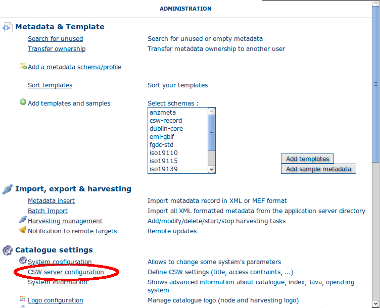
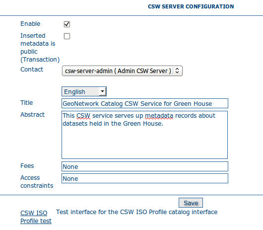

.. _csw_configuration:

OGC CSW server configuration
============================

To get to the CSW server configuration, you must be logged on as administrator first. Open the Administration page and select CSW Server configuration (The link is surrounded with a red ellipse in the image below).

Clicking on this link will open a configuration menu that looks like the following.

The Open Geospatial Catalogue Service for the Web (OGC-CSW) service,
is a self-describing service that allows query, update and insertion of metadata records. 
The service can be asked to provide a description of itself, the human who administers it and other information through a GetCapabilities request (eg. http://localhost:8080/geonetwork/srv/en/csw?request=GetCapabilities&service=CSW&version=2.0.2). This form allows you to configure the CSW server and fill out some of the properties returned in response to a GetCapabilities request. A description of each of the fields in this form now follows: 

*Enable*: This option allows you to start or stop the CSW
services. If this option is disabled, other catalogues cannot
connect to the node using CSW protocol.

*Inserted metadata is public*: By default, metadata inserted with the CSW Transaction operation is not 
publicly viewable. A user with the appropriate access rights could do this after the CSW Transaction operation, but this is not always convenient. 
If this option is checked all metatada inserted using the CSW Transaction operation will be publicly viewable.

*Contact*: The drop down select list shows the current
users in the local GeoNetwork catalog. The contact details of the user chosen 
from this list will be provided in the GetCapabilities document of the CSW
service. 

*Language*: The language that is used in the service description fields.

*Title*: The title of the CSW service.

*Abstract*: The abstract of the CSW service. The abstract can contain a brief description of what the service provides and who runs it.

*Fees*: If there are any fees for usage of the service then they should be detailed here.

*Access constraints*: If there are any constraints on access to the service then they should be detailed here.

The last function on this page is the CSW ISO Profile test. Clicking on this
link brings up a javascript based interface that allows you to submit requests
to the CSW server. The requests used by this interface are XML files in 
INSTALL_DIR/web/geonetwork/xml/csw/test.

.. COMMENT: TODO : Add documentation about config-csw.xml options
