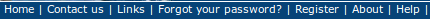
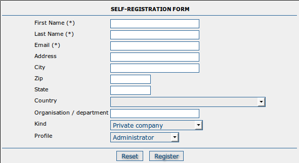

.. _user_self_registration:

User Self-Registration Functions
================================

To enable the self-registration functions, see the 'Basic Administration' section of this manual. When self-registration is enabled, the banner menu functions shown to a user who has not logged in should contain two additional choices: 'Forgot your password?' and 'Register' as follows:

If 'Register' is chosen the user will be asked to fill out a form as follows:

The fields in this form are as follows: 

*First Name*: The user's first name. This is mandatory.

*Last Name*: The user's last name. This is also mandatory.

*Email*: The user's email address. This is also mandatory and will be used as the username.

*Address*: The user's address.

*City*: The user's city.

*Zip*: The user's zip or postal code.

*State*: The user's state.

*Country*: The user's country.

*Organisation/department*: The user's organisation/department.

*Kind*: The kind of organisation/department.

*Profile*: By default, self-registered users are given the 'Registered User' 
profile (see previous section). If any other profile is selected, the user 
will still be given the 'Registered User' profile, but a request will be sent 
to the Email address nominated in the Feedback section of the 
'System Administration' menu informing them of the request for a more 
privileged profile.

When a user self-registration occurs, the user receives an email with the
details they have provided in it that looks something like the following:

::

	Dear User,

	  Your registration at The Greenhouse GeoNetwork Site was successful.
 
	  Your account is:
	  username :    dubya.shrub@greenhouse.gov
	  password :    0110O3
	  usergroup:    GUEST
	  usertype :    REGISTEREDUSER

	  You've told us that you want to be "Editor", you will be contacted by our office soon.

	  To log in and access your account, please click on the link below.
	  http://greenhouse.gov/geonetwork

	  Thanks for your registration.

		Yours sincerely,
		The team at The Greenhouse GeoNetwork Site

Notice that the user has requested an 'Editor' profile. As a result an email will be sent to the Email address nominated in the Feedback section of the 'System Adminstration' menu which looks something like the following:

::

	Dear Admin,     

		Newly registered user dubya.shrub@greenhouse.gov has requested "Editor" access for:

		Instance:     The Greenhouse GeoNetwork Site
		Url:          http://greenhouse.gov/geonetwork

		User registration details:
 
 		Name:         Dubya
 		Surname:      Shrub
 		Email:        dubya.shrub@greenhouse.gov
 		Organisation: The Greenhouse
 		Type:         gov
 		Address:      146 Main Avenue, Creationville
 		State:        Clerical
 		Post Code:    92373 
 		Country:      Mythical

 	Please action.

	The Greenhouse GeoNetwork Site
