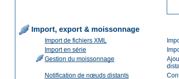

Moissonnage
===========

Introduction
------------

Depuis le début du projet en 2000, le besoin de partage des métadonnées entre
différents noeuds était présent. En général, chaque noeud se focalise sur une région
d'intérêt, il est donc nécessaire de pouvoir réaliser des recherches sur ces
différents catalogues. Ce mécanisme est appelé recherche décentralisée et utilise le
réseau Internet. Dans notre cas, cette recherche distribuée peut être complexe à
réaliser dans le cas ou de nombreuses données et imagettes doivent être échangées.
De plus, GeoNetwork est fréquemment utilisé dans des régions (tel que l'Afrique,
l'Asie) où la connectivité peut être limité rendant les recherches décentralisées
impossible ou du moins délicates.

Le moissonnage et un mécanisme permettant de collecter des métadonnées sur un
catalogue distant et de les stocker sur le noeud local pour un accès plus rapide.
Cette action de moissonnage est une action périodique, par exemple, une fois par
semaine. Le moissonnage n'est pas un import simple : les métadonnées locale et celle
du catalogue distant sont synchronisées. En effet, un catalogue GeoNetwork est
capable de découvrir quelles sont les métadonnées ayant été ajoutée, supprimée ou
mise à jour dans le noeud distant.

GeoNetwork peut moissoner les ressources suivantes (pour plus de détail, voir plus
bas):

#. Un noeud GeoNetwork (version 2.1 ou plus).

#. Un noeud GeoNetwork 2.0.

#. Un serveur WebDAV.

#. Un catalogue supportant CSW 2.0.1 or 2.0.2.

#. Un serveur OAI-PMH.

#. Un service OGC en utilisant le document GetCapabilities. Incluant les
services WMS, WFS, WPS et WCS.

Présentation du mécanisme
-------------------------

Le moissonnage repose sur le concept **d'identifiant unique
(uuid)**. Cet identifiant est en effet particulier car il n'est pas
seulement unique au sein du catalogue mais dans le monde entier. Celui-ci est une
combinaison entre l'adresse MAC, la date et l'heure ainsi qu'un nombre aléatoire.
Chaque fois que vous créz des métadonnées dans GeoNetwork, un nouvel uuid est généré
puis assigné à la métadonnée.

Un autre concept important derrière la notion de moissonnage est la **date
de dernière mise à jour**. Chaque fois que vous modifiez une
métadonnée, la date est mise à jour. En comparant cette information, il est possible
de savoir si la métadonnée a été mise à jour.

Ces deux concepts permettent à GeoNetwork de récupérer les métadonnées distantes,
vérifier leur mise à jour et les supprimer si elles ont été supprimées. Par
ailleurs, grâce aux identifiants uniques, une hiérarchie de noeuds peut être
moissonée où un noeud B moissone un noeud C C et un noeud A moissonne B. Des boucles
peuvent être créées car les métadonnées moissonnées ne peuvent pas être modifiées.

Cycle de vie du moissonnage
---------------------------

Lors de la configuration d'un noeud, il n'y a pas de métadonnées. Pendant la
première itération , toutes les métadonnées qui correspondent au paramétrage sont
récupérées et stockées localement. Ensuite, seulement les changements sont
retournés. Les métadonnées moissonées ne sont pas éditable :

#. Le moissonnage est périodique donc les changements sur le noeud local
seraient perdus.

#. La date de mise à jour est utilisée pour garder trace des changements, à
chaque édition elle est mise à jour en dehors du site originel, le mécanisme
de moissonnage serait compromi.

Au delà des métadonnées, ceci implique que l'utilisateur ne peut pas changer les
autres propriétés (eg catégories, privilèges etc...).

Le moissonnage fonctionne jusqu'à rencontrer un des cas suivantes :

#. Un administrateur arrête le noeud.

#. Une exception.

Lorsqu'un noeud est supprimé, toutes les métadonnées associées sont également
supprimées.

Moissonnages multiples et hiérarchie
------------------------------------

Les catalogues fournissant des identifiants uniques (par exemple un noeud
GeoNetwork et un serveur CSW) peuvent être moissoné plusieurs fois sans craindre les
doublons.

Ce mécanisme permet aux différents types de moissonnage de GeoNetwork de réaliser
des moissonnages avec des hiérarchies complexes de noeuds. De cette façon, un
métadonnée peut être moissonée à partir de différents noeuds. Par exemple, dans les
cas suivants :

#. Noeud (A) créé la métadonnée (a)

#. Noeud (B) moissone (a) depuis (A)

#. Noeud (C) moissone (a) depuis (B)

#. Noeud (D) moissone depuis (A), (B) et (C)

Dans ce scénario, le noeud (D) aura la même métadonnée (a) à partir des 3 noeuds
(A), (B), (C). La métadonnée va remonter dans le noeud (D) en suivant 3 voies
différentes mais les uuid permettent de stocker une seule copie. Lorsque la
métadonnée (a) change au sein du noeud (A), une nouvelle version remonte au noeud
(D) mais, en utilisant la date de mise à jour, la copie dans le noeud (D) sera mise
à jour avec la version la plus récente.

Autres remarques
----------------

Principes
`````````

#. Le moteur de moissonnage ne stocke pas les métadonnées.

#. Un changement des paramètres du moissonnage (par exemple les
privilèges et catégories) sera pris en compte au prochain
moissonnage.

Moissonnage de catalogue GeoNetwork
```````````````````````````````````

#. Au cours du moissonnage, les icônes sont moissonées et les copies
locales mises à jour. Les icônes sont également propagées aux autres
noeuds.

#. L'identifiant unique des métadonnées est récupéré dans le fichier
info.xml du format MEF. Tout uuid stocké dans les métadonnées est
remplacé par celui-ci.

Moissonnage de répertoire WebDAV
````````````````````````````````

#. La même métadonnée peut être moissonée plusieurs fois sur différents
noeuds. Cependant, ce n'est pas une bonne pratique car chaque copie
auront un uuid différent et le système se rempliera de la même copie de
métadonnées.

Moissonnage de service CSW
``````````````````````````

#. Si le champ dct:modified est absent de la réponse GetRecords la
métadonnées sera toujours moissonée.

#. Toute exception ayant lieu lors de l'opération getRecordById est
annulée et la métadonnée passée.

Moissonnage de serveur OAI-PMH
``````````````````````````````

#. L'identifiant du serveur distant doit être un uuid. Dans le cas
contraire, la métadonnée peut être moissonée mais des problèmes peuvent
se produire dans le cas de hiérarchie.

#. Au cours du moissonnage, GeoNetwork essaye de détecter automatiquement
le schéma de chaque métadonnée. Si le schéma est inconnu, la métadonnée
n'est pas importée.

Moissonnage de service OGC
``````````````````````````

#. Chaque fois que le moissonnage fonctionne, GeoNetwork supprime les
informations moissonées auparavant et en crée de nouvelles. GeoNetwork
génére les identifiants pour toutes les métadonnées (aussi bien pour les
services que les données). Cependant, pour les données, si la métadonnée
est créée en utilisant document XML distant si un attribut MetadataUrl
est présent dans le document GetCapability), l'identifiant de ce
document est conservé.

#. Les imagettes sont générées pour les services WMS uniquement. Le
service doit de plus supporter la projection WGS84.

La page principale
------------------

Pour accéder à l'interface de configuration du moissonnage, vous devez vous
identifier en tant qu'administrateur. A partir de la page d'administration, cliquer
sur le lien :ref:`admin_harvesting_where` Gestion du moissonnage.



  **Interface de configuration du moissonnage**

:ref:`admin_harvesting_list` présente l'interface de configuration du
moissonnage. Cette page présente la liste des noeuds moissonés qui ont été créés. Au
bas de la page, les buttons permettent de gérer les actions des noeuds. La
définition des colonnes est la suivante :

#. **Sélectionner**: Case à cocher pour la sélection d'un noeud. Fonction des
actions lancées (Activer, Désactiver, Lancer, ...), le noeud sélectionné
sera impacté. Par exemple, si vous sélectionnez 3 noeuds, ceux là seront
supprimés.

#. **Nom**: Nom du noeud tel que défini par l'administrateur.

#. **Type**: Type de noeud (GeoNetwork, CSW, WebDav, ...).

#. **Status**: Icône représentant l'état du noeud. Voir :ref:`admin_harvesting_status` pour les différents status
possibles.

#. **Erreur**: Status du dernier moissonnage joué. Les informations sur le
moissonnage (nombre de résultats, ajouts, suppression sont disponibles dans
l'info bulle de l'icône. Voir See :ref:`admin_harvesting_status_2`.

#. **Fréquence (j:h:m)**: Fréquence de moissonnage.

#. **Dernière exécution**: Date du dernier moissonnage.

#. **Opération**: Opérations possibles sur le noeud dont l'édition des
propriétés.


  **La page de moissonnage**

Le bas de la page présente deux rangés de bouttons. La première ligne peuvent
réaliser des actions sur un ou plusieurs noeuds. Vous pouvez sélectionner les noeuds
en utilisant les case à cocher dans la première colonne et presser sur le bouton
correspondant à l'action souhaitée. Lorsque le bouton termine son action, la case à
cocher est désactivée. La deuxième ligne contient des boutons correspondant à des
actions générales. Les actions possibles sont les suivantes :

Activer : Lors de la création d'un noeud, son état est
**inactif**. L'utilisation de ce bouton le rend
**actif** et permet de commencer le moissonnage du noeud distant.
Désactiver permet l'arrêt du moissonnage périodique du noeud. Ceci ne signifie pas
qu'un moissonnage en cours sera arrêté mais que le noeud sera ignoré lors des
moissonnages futurs. Lancer permet de réaliser le moissonnage immédiatement. Ceci
permet de tester facilement les paramètres de configuration d'un noeud. Supprimer
permet la suppression d'un ou plueiurs noeuds. Un message demande confirmation avant
suppression. Retour permet de retourner à la page d'administration. Ajouter permet
la création d'un nouveau noeud. Rafraîchir permet de mettre à jour la liste des
noeuds et leur état.

.. _admin_harvesting_status:

Icône représentant les différents états
```````````````````````````````````````
table-width="75%"

Icône

Etat

Description

Inactif

Le moissonnage est désactivé pour ce noeud.

Actif

Le moteur de moissonnage attend la prochaine exécution pour ce
noeud. Lorsque l'heure est arrivée, le moissonnage est
lancé.

En cours

Le moteur de moissonnage est en cours, récupérant les
métadonnées depuis le noeud distant. Lorsque le processus est
terminé, l'état revient à actif.

.. _admin_harvesting_status_2:

Icône pour les erreurs
``````````````````````
table-width="75%"

Icônes

Description

Le moissonnage s'est bien déroulé, pas d'erreur rencontrée.
Dans ce cas, une info bulle présente une synthèse du moissonnage
(nombre de métadonnées ...).

Le moissonnage a été annulé suite à une erreur. L'info bulle
présente alors l'erreur rencontrée.

Info bulle présentant les résultats du moissonnage
``````````````````````````````````````````````````

Si le moissonnage s'est déroulé correctement, une info-bulle présente les
informations détaillée au sujet du processus. De cette façon il est possible de
vérifier que le moissoneur a fonctionné ou s'il y a des paramètres à préciser.
L'info bulle est un tableau présentant :

Total est le nombre total de métadonnées trouvées dans le noeud distant. Les
métadonnées avec le même identifiant sont considérées comme une seule. Ajouté
correspond au nombre de métadonnées ajoutées au système car elle n'était pas
présente localement. Supprimé correspond au nombre d'enregistrement supprimés
car non présent dans le noeud distant. Mis à jour indique le nombre de
métadonnées mises à jour du fait d'un changement de date de dernière mise à
jour. Inchangé présente le nombre de métadonnées non modifiées. Schema inconnu
indique le nombre de métadonnées non intégrées du fait d'un schéma non reconnu
par GeoNetwork. Inrécupérable correspond à des erreurs de transfert
d'information lors du moissonnage. Mauvais format correspond à des métadonnées
ayant un document XML invalide. Validation correspond aux métadonnées invalides
par rapport à leur schéma.

Types d'information selon le type de moissonnage
^^^^^^^^^^^^^^^^^^^^^^^^^^^^^^^^^^^^^^^^^^^^^^^^
table-width="90%"

Résultat vs Type de moissonnage

GeoNetwork

WebDAV

CSW

OAI-PMH

Service OGC

Total

x

x

x

x

x

Ajouté

x

x

x

x

x

Supprimé

x

x

x

x

x

Mis à jour

x

x

x

x

Inchangé

x

x

x

x

Schema inconnu

x

x

x

x

x

Irrécupérable

x

x

x

x

x

Mauvais Format

x

x

Non valide

x

x

Imagettes

x

Utilisation de l'attribut MetadataURL

x

Ajouter de nouveaux noeuds
--------------------------

Le bouton ajouter de la page principale permet l'ajout de nouveaux noeuds. En
cliquant sur ce bouton, vous accèdez à la page présentée :ref:`admin_harvesting_add`. Lors de la création d'un nouveau noeud, vous
devez choisir le type de moissonnage du serveur distant. Les protocoles supportés
sont les suivants :

#. Geonetwork est le protocole le plus avancé utilisé dans GeoNetwork. Celui-ci
permet de se connecter à un noeud distant et de réaliser une recherche utilisant les
critères de recherche et importer les métadonnées correspondantes. De plus, ce
protocol permet de transférer les privilèges et les catégories des métadonnées
moissonées si ils existent localement. Notez que depuis la version 2.1 de GeoNetwork
protocole de moissonnage s'est amélioré. Il n'est pas possible de moissoner les
anciennes version de GeoNetwork.

#. Web DAV permet d'utiliser les répertoires Web DAV (Distributed Authoring and
Versioning) . Il peut être pratique pour des utilisateurs souhaitant publier leurs
métadonnées via un serveur web supportant l'interface DAV. Le protocole permet de
récupérer le contenu d'une page (la liste des fichiers présent sur le webdav) avec
leur date de mise à jour.

#. CSW correspond à **Catalogue Services for the Web** et est une
interface de recherche pour les catalogues développé par l'Open Geospatial
Consortium. GeoNetwork est compatible avec la version 2.0.1 et 2.0.2 de ce
protocole.

#. Ancienne version de GeoNetwork permet de moissoner d'ancien noeud GeoNetwork car
depuis la version 2.1 le mécanisme de moissonnage a fortement évolué. Un catalogue
en version 2.0 peut toujours moissoner un catalogue en version 2.1 mais un catalogue
2.1 doit utiliser ce protocole pour moissoner un ancien noeud. Ce mécanisme est
conservé tant que les versions 2.1 et sup. ne sont pas largement déployée.

#. L'acronyme OAI-PMH correspond à **Open Archive Initiative Protocol for
Metadata Harvesting**. C'est un protocole largement utilisé. GeoNetwork
est compatible avec la version 2.0 de ce protocole.

La liste déroulante présente la liste des protocoles disponibles. En cliquant sur
Ajouter, vous accédez la page d'édition des paramètres qui dépend du type de
protocole choisi. Le bouton retour permet de revenir à la page principale.


  **Ajouter un nouveau noeud**

Ajouter un noeud GeoNetwork
```````````````````````````

Ce type de moissonnage permet de se connecter à un catalogue et GeoNetwork et
de réaliser des recherches simples. La recherche permet ainsi d'obtenir les
métadonnées utiles uniquement. Une fois le noeud ajouté, vous accédez à une page
du type :ref:`admin_harvesting_gn`. La définition des paramètres est
la suivante :

.. figure:: web-harvesting-gn.png

  **Paramètre pour les noeuds de type GeoNetwork**

Site permet d'attribuer un nom au noeud moissoné en précisant le nom d'hôte,
le port et le nom du servlet (en général geonetwork). Si vous souhaitez accéder
à des métadonnées protégées, vous devez spécifier un compte utilisateur. Dans la
section recherche, les paramètres présentés correspondent à ceux disponibles
dans l'interface de recherche du catalogue. Avant de paramètrer cette
information vous devez vous rappeler qu'un catalogue GeoNetwork peut moissoner
de manière hierarchique et donc que les catalogues sont susceptibles de contenir
à la fois leur métadonnée mais aussi celles moissonées à partir d'autres noeuds.
Le bouton obtenir les sources permet d'avoir la liste des noeuds du catalogue
distant. Une fois obtenu, vous pouvez donc restreindre votre recherche à cette
source uniquement. Sinon la recherche portera sur l'ensemble des métadonnées
(moissonées ou non). Il est possible d'ajouter plusieurs critères de recherche
avec le bouton ajouter. Les recherches seront réalisées et les résultats
conbinés. Le bouton à la gauche du bloc de critère permet la suppresion de
chaque bloc. Si aucun critère n'est défini, la recherche récupérer l'ensemble du
catalogue distant. La section Option correspond aux options générales.

La fréquence permet de définir l'interval entre chaque itération du
moissonnage. Elle peut être défini entre 1 min et 100 jours maximum. Une seule
éxecution permet de faire la recherche une fois et de désactiver le moissonnage
ensuite. La section privilèges permet de définir les privilèges selon les
groupes. Il est possible de copier des privilèges pour chaque groupe. Le groupe
Intranet n'est pas pris en compte car ça n'a pas de sens de copier les
privilèges pour ce groupe. Le groupe Internet a des privilèges différents :

#. Copier : copier les privilèges.

#. Copier pour le groupe Intranet : Les privilèges sont copiés mais pour
le groupe Intranet. De cette façon les métadonnées ne sont pas
publiques.

#. Ne pas copier : Les privilèges ne sont pas copiés et les métadonnées
ne seront pas publiques.

Pour les autres groupes :

#. Copier : Les privilèges sont copiés uniquement si un groupe ayant
exactement le même nom existe dans le catalogue.

#. Créer et copier : Les privilèges sont copiés. Si le groupe n'existe
pas, celui-ci est également créé.

#. Ne pas copier : Les privilèges ne sont pas copiés.

En bas de page le bouton retour permet de revenir à la page de configuration
du moissonnage. Le bouton sauver permet de sauver la configuration en cours.
Lors de la création d'un noeud, le noeud sera créé lors de cette action de
sauvegarde.

Ajouter un noeud de type Web DAV
````````````````````````````````

Dans ce cas, les métadonnées sont récupérées depuis un page web. Les options
disponibles se présentent de la manière suivante :ref:`admin_harvesting_webdav` et sont définies par :


  **Ajouter un noeud de type Web DAV**

La section site donne les informations de connexion :

Le nom permet d'attribuer un nom au noeud distant L'URL correspond à l'URL du
répertoire Web DAV Pour chaque fichier ayant une extension .xml sera considéré
comme une métadonnée et sera importé. L'icône permet d'assigner une icône aux
métadonnées moissonées . Celle-ci sera visible dans les résultats de recherche.
La section compte utilisateur permet de définir les paramétres d'identification
nécessaire à une authorisation basique HTTP. Les options générales sont :

Les paramètres fréquence et une seule éxecution sont présentés dans le type de
moissonnage GeoNetwork. L'option valider permet de valider les métadonnées
pendant l'import. Si la validation est réussie, la métadonnée est importée sinon
elle est rejetée. Lorsque le moteur de moissonnage rencontre un répertoire, il
parcourt le répertoire si l'option récursif est sélectionnée. Les privilèges
peuvent être assignés aux différents groupes du catalogue locale. Pour cela,
sélectionnez un ou plusieurs groupes, cliquez sur ajouter puis définissez les
privilèges pour chacun. La section catégories permet d'attribuer une catégorie à
l'ensemble des métadonnées récupérées.

En bas de page le bouton retour permet de revenir à la page de configuration
du moissonnage. Le bouton sauver permet de sauver la configuration en cours.
Lors de la création d'un noeud, le noeud sera créé lors de cette action de
sauvegarde.

Ajouter un noeud de type CSW
````````````````````````````

Ce type permet de se connecter à un catalogue supportant le protocle CSW . Les
métadonnées doivent avoir un schéma connu par GeoNetwork. :ref:`admin_harvesting_csw` présente les options de configuration :


  **Ajouter un noeud de type CSW**

Le site permet de définir les paramètres de connexion de la même manière que
pour le type Web DAV . Dans ce cas, l'URL pointe vers le document
GetCapabilities du serveur CSW. Ce document permet d'obtenir les adresses pour
réaliser les recherches distantes. Ajouter des critères de recherche de la même
manière que pour les catalogues de type GeoNetwork en cliquant sur le bouton
ajouter. Pour les options générales ou les catégories, reportez-vous à la
description dans la section Web DAV.

En bas de page le bouton retour permet de revenir à la page de configuration
du moissonnage. Le bouton sauver permet de sauver la configuration en cours.
Lors de la création d'un noeud, le noeud sera créé lors de cette action de
sauvegarde.

Ajouter un noeud de type OAI-PMH
````````````````````````````````

OAI-PMH est un protocole que GeoNetwork, en tant que client, est capable de
moissonner. Si vous demandez un format oai_dc, GeoNetwork le convertira en
dublin core. D'autres formats peuvent être moissonés si et seulement si
GeoNetwork connait le schéma. :ref:`admin_harvesting_oaipmh` présente
les différentes options :


  **Ajouter un noeud de type OAI-PMH**

Pour la section site les options sont les mêmes que pour le moissonnage de
type web DAV. La seule différence est que l'URL pointe vers le serveur OAI.
Cette URL est le point d'entrée pour les commandes PMH que GeoNetwork exécute.
La section recherche permet de définir les critères de recherche. Plusieurs
recherches peuvent être renseignée. et les résultats combinés. Dans chaque
recherche, les paramètres suivants peuvent être définis :

La date de début et de fin correspondant à la date de mise à jour des
métadonnées. Pour cela utiliser le calendrier en cliquant sur l'icône pour le faire
apparaître. Ce champ est optionel. Utiliser l'icône pour effacer le critère.
Jusqu'à fonctionne de la même manière mais ajoute un contraint sur la date de
dernier changement. Les ensembles permettent de classifier les métadonnées dans
des groupes hierarchiques. Vous pouvez donc filtrer les métadonnées
n'appartenant qu'à un seul ensemble (et ses sous-ensembles). Par défaut, un
option vide définie **aucun ensemble**. En cliquant sur obtenir
des information vous pouvez obtenir la liste des ensembles ainsi que la liste
des préfixes. La notion de préfixe détermine ici le format de métadonnée. Le
préfixe oai_dc est obligatoire pour les serveurs OAI-PMH..

Vous pouvez utiliser le bouton ajouter pour ajouter des critères de
recherches. Les options, les privilèges et les catégories sont similaires aux
autres type de moissonnage.

En bas de page le bouton retour permet de revenir à la page de configuration
du moissonnage. Le bouton sauver permet de sauver la configuration en cours.
Lors de la création d'un noeud, le noeud sera créé lors de cette action de
sauvegarde.

Noter que lors d'un retour à la page édition, les listes sur les
**ensembles** et les **préfixes** sont
vides. Elles ne contiendront que les entrées précédemment sélectionnées. Vous
devez cliquer sur le bouton obtenir les info pour récupérer l'ensemble des
valeurs possibles.

Ajouter un noeud de type service OGC (ie. WMS, WFS, WCS, WPS)
`````````````````````````````````````````````````````````````

Un service OGC implément une opération GetCapabilities que GeoNetwork, en tant
que client, peut utiliser pour produire des métadonnées. Le document
GetCapabilities fourni des informations sur le service et les données
(layers/feature types/coverages/process) diffusées. GeoNetwork converti ces
données au format ISO19139/119. :ref:`admin_harvesting_ogc` présente
les différentes options :


  **Ajouter un noeud de type service OGC (ie. WMS, WFS, WCS, WPS)**

La section site permet de définir le nom. Le type de service OGC indique au
moteur de moissonnage le type de version pour le service. Les types supportés
sont WMS (1.0.0 et 1.1.1), WFS (1.0.0 et 1.1.0, WCS (1.0.0) et WPS (0.4.0 et
1.0.0). L'URL du service est l'URL permettant de se connecter au service (sans
paramètres tel que "REQUEST=GetCapabilities", "VERSION=", ...). Cette url doit
être valide http://your.preferred.ogcservice/type_wms. La langue des métadonnées
doit être spécifiée étant donnée qu'aucune information n'est disponible sur ce
point dans un document GetCapabilities. Cette langue sera la langue par défaut
des métadonnées. Elle doit correspondre à la langue utilisée par
l'administrateur du service OGC. Le topic ISO est ajouté à la métadonnée. Il est
recommandé d'en choisir un car ce champ est obligatoire dans le standard ISO si
le niveau de hiérarchie est "datasets".

Le type d'import permet de définir si le moissonnage doit produire seulement
une fiche de métadonnée pour le service ou si il doit également créer les
métadonnées pour chaque donnée disponible au sein du service. Pour chaque jeux
de données, la deuxième option permet d'utiliser l'attribut MetadataURL du
document GetCapabilities pour générer la métadonnée. Le document référencé dans
cet attribut doit être un document XML valide dans un format connu par
GeoNetwork. Pour les WMS, les imagettes peuvent être créées automatiquement.

Les icônes et les privilèges sont définis de la même manière que les autres
types de moisson.

La métadonnée du service peut être associée à une catégorie (en générale
"interactive resources"). Pour chaque données, il est également possible de
choisir une catégorie.


