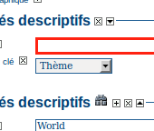
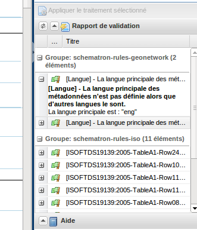
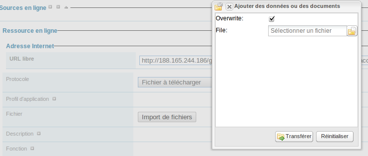
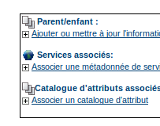
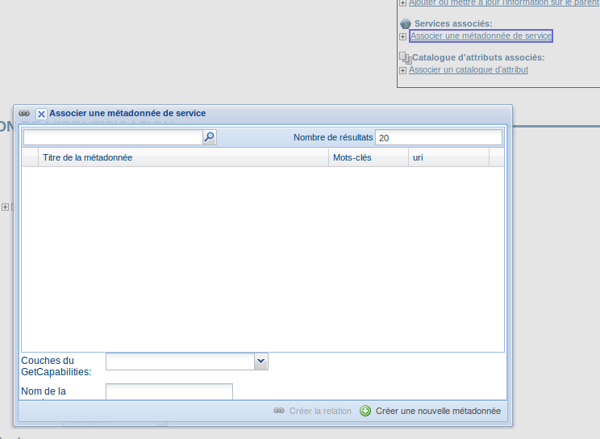

Saisie de l'information
=======================

Cette partie présente la manière de créer et saisir des métadonnées dans le catalogue
en utilisant soit l'éditeur en ligne, soit l'outil d'insertion basé sur les documents
XML. Dans les deux cas, vous utiliserez le système de modèles (templates), l'ajout
d'aperçu, le téléchargement de données, le lien vers des services et la gestion des
privilèges pour l'accès aux données et aux métadonnées.

Pour ajouter et éditer une métadonnée, vous devez être **enregistré** comme **Editeur** dans le groupe
dans lequel vous souhaitez l'ajouter. Si ce n'est pas le cas, contactez
l'administrateur.

Pour la création d'une métadonnée utilisant l'éditeur en ligne, Géosource fournit un
certain nombre de modèles de métadonnées basés sur les normes ISO 19115/119. Ces modèles
permettent de décrire divers types de ressource (données vecteur ou raster, services
WMS/MFS, service de téléchargement...) avec un nombre minimal d'éléments pré-remplis
dans la vue découverte. Ces modèles peuvent être complétés avec des éléments de la vue
avancée.

Afin de saisir correctement une métadonnée, vous devez donner un maximum de détails
pour décrire la ressource en prenant en compte les éléments qui ont été présentés dans
le chapitre précédent.

Les champs les plus importants à remplir sont les suivants :**Le
titre, la date de création et de publication, le résumé, la langue utilisée pour
documenter la donnée, le thème, l'échelle, la maintenance et la fréquence de mise à
jour, la langue de la métadonnée**.

En plus des champs obligatoires, nous recommandons de remplir ces champs optionnels
mais importants (si ces informations sont disponibles) :**l'objectif, les mots-clés, la forme, l'état, le type de erprésentation spatiale, la
localisation géographique, les informations sur le système de référence, l'étendue
temporelle, les informations sur la qualité, les contraintes d'accès et
d'utilisation, le point de contact, les informations sur la distribution (ressource
en ligne)**

- Vous avez également la possibilité de fournir un aperçu de la ressource, qui apparaîtra dans les résultats de la recherche.

- La prochaine section vous guidera vers le processus de création utilisant l'éditeur en ligne.


Créer une nouvelle métadonnée
-----------------------------

#. Dans la page d'accueil, cliquez sur **l'onglet "administration"**.

#. Selectionner **"nouvelle métadonnée"**.

#. Selectionner le modèle de métadonnée sachant que d'autres modèles peuvent être créés.

#. Selectionner le **Groupe** auquel sera rattaché la métadonnée. Les groupes proposés sont ceux autorisés par l'administrateur pour l'utilisateur en cours d'édition.

#. Cliquez sur **"créer"**.

En détail
`````````

#. Entrez votre identifiant et mot de passe et cliquez sur le bouton
   "Connecter" (:ref:`login_adding`). Le système vous
   identifiera et vous assignera les privilèges correspondant à votre
   compte.


   .. figure:: login.png

     *Login*

#. Ouvrez la page d'administration en cliquant sur le bouton
   "Administration" puis cliquez sur le lien de la nouvelle métadonnée

   .. figure:: Admin.png
  
     *Administration panel*

#. A partir de la page de création de métadonnée, sélectionnez le
   standard

   .. figure:: metadataCreation.png
  
     *Sélection du modèle*

#. Après avoir sélectionné le modèle correct, vous devez identifier à
   quel groupe d'utilisateurs se rattachera la métadonnée créée (:ref:`select_group`)puis cliquez sur **"Créer"**.

   .. figure:: selectGroup.png
    
   *Sélection du groupe*
    
Une nouvelle métadonnée basée sur le modèle sélectionné est ensuite créée.


Basculer entre les vues
```````````````````````

Les vues ont été présentées `précédemment <../gui/index.html#les-vues>`_.

Lorsque vous créez un nouvel enregistrement, vous pouvez choisir entre
**Vue découverte**, **Vue
avancée**, **Vue complète** ou
**Vue XML**. Pour charger la vue, cliquez
simplement sur la vue correspondante dans la colonne de gauche de la page. La
vue en **gras** correspond à la vue courante.

  .. figure:: switchViews.png

  *Options sur la vue de métadonnée*

Les champs obligatoires et conditionnelles
``````````````````````````````````````````
Les champs obligatoires sont signalés par une astérisque.

Les champs dont la saisie est invalides sont entourés en rouge.
Il peut s'agir :

- d'un champ obligatoire non rempli

- d'un champ numérique contenant du texte (avec ou sans décimale)

- d'une adresse email invalide.


Il existe par ailleurs des champs conditionnels.
Par exemple, pour les contacts, 

- un des champs nom, organisation ou position pour un contact
  doit être renseigné selon l'ISO.

- un des champs organisation ou email doit être renseigné selon INSPIRE 

  .. figure:: PoC_Maint.png

  *Point de contact*

Pour identifier les erreurs sur les champs conditionnels, utiliser le `rapport
de validation <#valider-les-metadonnees>`_.


L'aide
``````

La définition de chacun des champs peut
être lu en cliquant sur le libellé du champ.


Utiliser les contrôles des champs de l'éditeur
````````````````````````````````````````````````````````````````````

Les champs ont soit **des domaines de texte
libre** soit **des lstes de codes**.
Texte libre signifie que vous pouvez écrire n'importe quel texte dans ce champ.
Drop down lists allow you to select only one option from the list. You can add
multiple fields of the same kind by clicking on the **[+]** symbol next to the element. Every new field that you will
add in the advanced view will then be visible in the default view. You can also
delete existing fields by clicking on the **[x]**
symbol next to the element. Clearly, mandatory fields cannot be deleted. One
example of the need to add multiple fields can arise if the content of your
dataset has some text written in two different languages (:ref:`multilingual_data`).



  **Describing multilingual data**


Saisir les métadonnées pour vos données géographiques
-----------------------------------------------------


As we mentioned in the introduction to this guide, GNos provides tools to describe
any type of geographic data (vector layers, raster, tables, map services, etc.) as
well as general document like reports, projects, papers, etc. For the purpose of
this Quick Start Guide, an example of required and useful metadata elements to
properly describe a thematic map will be provided hereafter. You should gather as
much information as possible to identify and understand the map’s resource and
characteristics you want to describe. Use the default view to start. If necessary,
you can always switch to advanced view or come back later and edit the record with
the additonal information collected.

Entering Metadata For Your Map
``````````````````````````````

Please follow these steps to enter your map's metadata. Note that we will only
go through the fields that have been identified as compulsory (i.e. those fields
marked with the asterix **[\*],** mandatory or
highly recommended).


**Titre** : Dans les informations d'identification saisir le nom par défaut de votre jeu de données.


**Date ** : Indique la **date** exacte de **création**,
**publication** ou **révision** de votre jeu de données


**Forme de présentation**: spécifie le type de
présentation i.e. **digital**, **document papier**, **table**, etc.


**résumé** : description du jeu de données


**Objectifs**: un court résumé des objectifs du jeu
de données.


**Etat**: Spécifie l'état de votre jeu de données,
avec différents choix possibles : complété, archive historique, obsolète, en
cours, planifié, requis, en cours de développement.


**Point de Contact**: Saisir l'information sur le
contact sur la ressource. A noter que certains champs sont conditionnels, comme
le nom de l'organisation si le nom individuel ou la position ne sont pas
renseignés.


**Maintenance and update frequency *** : Specify
the frequency with which you expect to make changes and additions to your map
after the initial version is completed. If any changes are scheduled you can
leave As Needed selected from the drop-down list.


**Descriptive Keywords**: Enter keywords that
describe your map. Also specify the type of keyword you are entering, i.e.
place, theme, etc. Remember that you can add another keyword field if you need
to add different types of keywords.


**Access Constraints**: Enter an access constraint
here, such as a copyright, trademark, etc. to assure the protection of privacy
and intellectual property.


**User Constraints**: Enter a user constraint here
to assure the protection of privacy and intellectual property.


**Other Constraints *** : Enter other constraint
here to assure the protection of privacy and intellectual property. Note that
this field is conditionally mandatory if Access and Use constraints are not
entered.


**Spatial representation type**: Select, from the
drop-down list the method used to spatially represent your data. The options
are: vector, grid, text table, stereo model, video.


**Scale Denominator *** : Enter the denominator for
an equivalent scale of a hard copy of the map.


**Language *** : Select the language used within
your map


**Topic category *** : Specify the main ISO
category/ies through which your map could be classified (see Annex for the
complete list of ISO topic categories).


**Temporal Extent *** : Enter the starting and
ending date of the validity period.


**Geographic Bounding Box *** : Enter the longitude
and latitude for the map or select a region from the predefined drop-down list.
Make sure you use degrees for the unit of the geographic coordinates as they are
the basis for the geographic searches.


**Supplemental Information**: Enter any other
descriptive information about your map that can help the user to better
understand its content.


**Distribution Info**: Enter information about the
distributor and about options for obtaining your map.


**Online Resource**: Enter information about online
resources for the map, such as where a user may download it, etc. This
information should include a link, the link type (protocol) and a description of
the resource.


**Reference System Info**: Enter information about
the spatial reference system of your map. The **default view
contains** one element to provide the **alphanumeric value** identifying the reference system used. GNos
uses the **EPSG codes** which are numeric codes
associated with coordinate system definitions. For instance, EPSG:4326 is
Geographic lat-long WGS84, and EPSG:32611 is "UTM zone 11 North, WGS84". Using
elements **from the advanced view**, you may add
**more details** on **data
projection,**
**ellipsoid** and **datum**. Note that if this information is provided, a reference
system identifier is not mandatory.


**Data Quality**: Specify the hierarchal level of
the data (**dataset series**, **dataset**, **features**, **attributes**, etc.) and provide a **general explanation on the production processes** (lineage) used
for creating the data. The statement element is mandatory if the hierarchical
level element is equal to dataset or
series. Detailed information on **completeness, logical consistency** and **positional**, **thematic** and
**temporal accuracy** can be directly added
**into the advanced form**.


**Metadata Author** : Provide information about
the author of the map, including the person’s name, organization, position, role
and any other contact information available.

After completion of this section, you may select the **Type** of document that you are going to save in the catalogue.
You have three options: **Metadata**, **Template**, **Sub-template**. By default **Metadata** is set up.

When done, you may click Save or Save and
Close to close the editing session.


Valider les métadonnées
-----------------------

In editing mode, editors could validate the current metadata record against standard rules and recommendations.

For all standards, a first level of validation is made for XML metadata validation based on XML Schema (XSD).
For ISO19139 records, other rules are checked:

- ISO recommandations

- GeoNetwork recommandations

- (Optional and not available by default) INSPIRE recommandations


The validation report display the list of rules checked and their status (pass or failed). The top checkbox allows to display only errors or all.




.. TODO : Maybe add more details on how to solve XSD error messages ?


Créer une imagette
``````````````````

Next, you need to create a graphic overview of your map which will be for a
double purpose; as small thumbnail will be displayed in search results and as
large thumbnail with much more details, to allow users to properly evaluate the
data usefulness. As for the latest, the image that you will use as source should
be a significant reproduction of the real dataset, possibly inclusive of the
legend.

To create a thumbnail, go to the editing menu for your map. If you are no
longer in editing mode, retrieve the map from one of the search options then
click on Edit. Then follow these simple steps:

- From the editing menu, click on the Thumbnails
  button on the top or bottom of the page. (:ref:`thumbnail_toolbar`)

.. figure:: thumButton.png

  **The thumbnail wizard button**

- You will be taken to the Thumbnail Management
  wizard (:ref:`thumbnail_wizard`).

- To create a small or large thumbnail, click on the
  Browse button next to either one. It is
  recommended that you use 180 pixels for small thumbnails and 800x600 for
  large thumbnails. Using the ‘Large thumbnail’ option allows you to
  create both a small and large thumbnail in one go.

- You can use GIF, PNG and JPEG images as input for the
  thumbnails.

- A pop up window will appear allowing you to browse your files on your
  computer. Select the file you wish to create a
  thumbnail with by double-clicking on it.

- Click on Add.

- Your thumbnail will be added and displayed on the following
  page.

- You can then click on Back to Editing and save your
  record (:ref:`completed_thumbnail_wizard`).


  **Thumbnail wizard**


  **Completed thumbnail wizard**

Associer des données à télécharger
``````````````````````````````````

Finally, you can upload the dataset stored on your local computer and then
create a link between data and related description. Files in whatever format can
be uploaded: doc, PDF, images, vector layers, etc. For the latter the
distribution in a compressed file is recommended. You can include the vector
data, the legend, any documentation that can help the interpretation of the
data, related reports, detailed descriptions of the data processing, base data
used to create the dataset specified and/or other relevant information. Follow
these guidelines for uploading datasets:

- Make sure the total size of the compressed file is reasonable (less
  than 50 MB). Should your data be bigger than 50MB, consider a different
  mechanism to serve this data, e.g. through an FTP or HTTP server and
  than link the resource through an online resource ‘Web address
  (URL)’.

- You can create several smaller files when appropriate and upload them
  sequentially.

- You add the size of the file at the end of the description
  field.

To Upload a Dataset, follow these steps :

#. The **URL** field can be left empty when
   uploading a file. The system will automatically fill this field
   out;

#. Select the correct **protocol** to be
   used. If you do not see the buttons to browse and upload when File for
   download is selected, save the metadata and return to the upload
   section. Both buttons should appear;

#. Provide a short **description** of the
   data;

#. Click the Browse button and navigate to the folder
   where the file to be released is stored. Consider if you want to upload
   multiple files as one unique zip file or as multiple separate downloads.
   It is a good idea to add additional documentation with the datasets that
   provide the user with information related to the data described. Remind:
   the size of a single file to upload can't exceed 50 Mbytes;

#. Click Upload and then
   Save.



  *An online resource*


Associer un service WMS pour la visualisation des données
---------------------------------------------------------

Vous pouvez associer une donnée publiée dans un service OGC WMS via la section ressource en ligne.

#. Editer la métadonnée

#. Aller dans l'onglet distribution

#. Saisir dans le champ URL l'adresse URL du service (eg. http://services.sandre.eaufrance.fr/geo/ouvrage)

#. Choisir le protocole WMS (ie. OGC Web Map Service ver 1.1.1)

#. Saisir dans le nom, le nom de la couche tel qu'écrit dans le document GetCapabilities du service

#. Eventuellement, saisir une description permettant d'avoir un libellé plus pertinent que le nom de la couche

#. Sauvegarder


Vous avez alors un bouton carte interactive dans les résultats de recherche.


La representation XML sera la suivante :

::

      <gmd:transferOptions>
        <gmd:MD_DigitalTransferOptions>
          <gmd:onLine>
            <gmd:CI_OnlineResource>
              <gmd:linkage>
                <gmd:URL>http://services.sandre.eaufrance.fr/geo/ouvrage</gmd:URL>
              </gmd:linkage>
              <gmd:protocol>
               <gco:CharacterString>OGC:WMS-1.1.1-http-get-map</gco:CharacterString>
              </gmd:protocol>
              <gmd:name>
                <gco:CharacterString>REPOM</gco:CharacterString>
              </gmd:name>
              <gmd:description>
                <gco:CharacterString>Installations portuaires</gco:CharacterString>
              </gmd:description>
            </gmd:CI_OnlineResource>
          </gmd:onLine>
        </gmd:MD_DigitalTransferOptions>
      </gmd:transferOptions>
    </gmd:MD_Distribution>
  </gmd:distributionInfo>


Publier les données téléchargées en WMS, WFS avec GeoServer
-----------------------------------------------------------

Les interactions avec un serveur cartographique tel que GeoServer permettent à l'utilisateur de rapidement configurer les données pour leur diffusion.

Les serveurs cartographiques supportés sont :

- GeoServer embarqué avec GeoNetwork

- Un GeoServer distant (version 2.x ou sup.)


Ce mécanisme permet aux utilisateurs la publication de fichier de type :

- GeoTiff

- ESRI Shapefile zippé


La données doit être associé à la métadonnée tel que décrit dans le chapitre `associer des données à télécharger <#associer-des-donnees-a-telecharger>`_.
Une fois télécharger, un bouton permet de géopublié la couche. La section ressource en ligne est mise à jour en conséquence avec la création d'un lien 
vers la couche WMS.


Configuration
`````````````
Si après l'envoi de la données, vous ne voyez pas le bouton de géopublication, demandez à l'administrateur de vérifier la configuration.
Cette fonctionnalité est désactivée par défaut. Elle peut être activée par configuration dans le fichier config-gui.xml.

Si vous ne voyez pas de noeud GeoServer dans l'assistant de publication, demandez à l'administrateur d'ajouter un noeud dans la configuration
dans le fichier geoserver-nodes.xml.


Publier vos données
```````````````````

* Editer une métadonnée

* Déposer un fichier tel que décrit dans le chapitre `associer des données à télécharger <#associer-des-donnees-a-telecharger>`_


En mode édition, dans la section ressource en ligne, l'assistant de géopublication est disponible :

* Choisir un noeud vers lequel publier la donnée
* GeoNetwork vérifie :

    - que le fichier est valide (eg. le ZIP contient un seul Shapefile ou tiff)
    - que la couche est déjà publiée dans le serveur distant. Dans l'affirmative, la couche est ajoutée à l'aperçu.

* Bouton publier : Publie la couche dans le géoservice. Si la donnée est déjà présente, elle est mise à jour.
* Bouton dépublier : Supprime la donnée du géoservice sélectionné.
* Ajouter la section ressource en ligne : Ajouter les informations pour faire la liaison avec la couche dans le service WMS.
* Bouton style : Ce bouton est disponible si le styler GeoServer est installé et déclaré dans la configuration.

Aucun nom de couche n'est demandé à l'utilisateur car celui-ci est généré à partir du nom du fichier.

Dans le cas de fichier ZIP, le nom du fichier ZIP DOIT être égale à celui du Shapefile ou du GeoTiff (ie. dans le cas de rivers.shp, le fichier ZIP sera rivers.zip).

Un entrepôt, un couche et un style sont créés pour chaque couche (one to one relation).


Associer les métadonnées
------------------------

En utilisant l'éditeur de métadonnée de GeoNetwork, l'utilisateur peut définir 3 types de relation :

- relation parent /enfant via l'élément gmd:parentIdentifier dans la section métadonnées

- relation métadonnées de données / métadonnées de services via l'élément srv:operatesOn de la section identification des métadonnées de services

- catalogue d'attribut (ISO19110) / métadonnées de données (ISO19139)


Toutes ces relations sont présentées dans l'éditeur, en haut à droite. Le menu permet la navigation entre les métadonnées.
Seul les métadonnées visibles pour l'utilisateur sont affichées (ie. une métadonnée peut être associée mais non affichée car
l'utilisateur n'a pas les privilèges pour la consultation de celle-ci).


Relation de type parent/enfants
```````````````````````````````

Pour créer des relations parents/enfants, l'éditeur peut sélectionner l'option créer un enfant dans le menu autres actions.


En utilisant cette option, l'identifiant du parent est automatiquement mis à jour lors de la copie de l'enregistrement; le reste de la métadonnée est copiée.


L'éditeur peut également associer une métadonnée existante en allant dans la vue avancée section métadonnée et mettre à jour le champ identifiant du parent.
En cliquant sur le lien ajouter ou mettre à jour le parent dans le menu des relations vous emmènera également dans cette section.
En cliquant sur le (+) pour déplier le champ identifiant du parent, l'assistant de sélection d'une métadonnée s'affiche.

Une fois le parent sélectionner, il apparaîtra dans le menu des relations.



Si une métadonnée à un enfant associé, l'éditeur proposera le mécanisme de mise à jour des enfants qui permet de propager les informations
du parent vers l'ensemble de ses enfants.

L'interface suivant permet de configurer le transfert d'information :


Métadonnées de données, métadonnées de services
```````````````````````````````````````````````

Les services (eg. WMS, WFS) pourront être référencés dans le catalogue.


La métadonnée de service (MDS) est saisie dans la norme ISO19139/ISO19119.

 
L'ISO19119 définie la section "identification du service".


Il est alors possible de décrire 4 types de relations dans les MDD et MDS :

#. Les métadonnées de données >> la couche correspondante diffusée par le service
   Aucune méthode n'est définie par l'ISO ou INSPIRE pour créer cette relation. Cependant, GeoNetwork a utilisé la section distribution pour cela. Voir `la section sur l'association d'un service WMS <#associer-un-service-wms-pour-la-visualisation-des-donnees>`_.
   
#. Les métadonnées de service OGC >> métadonnée de données
   
   Cette relation est stockée de la manière suivante dans le document XML :

   .. code-block:: xml

         <srv:operatesOn uuidref="9fe71d39-bef7-4d45-a3b3-12afbd01908f" />
       </srv:SV_ServiceIdentification>
     </gmd:identificationInfo>
    
   Le catalogue propose une popup de recherche et sélection pour faire l'association. Une fois la relation présente, il est possible de naviguer de la métadonnée de service, vers la métadonnée de données.
   
#. Les métadonnées du service >> le service  
   La métadonnée de service décrit les opérations du service ainsi que son point d'accès en général saisie dans la section distribution.
   

#. Les métadonnées du service >> les couches diffusées par le service   
   La spécification CSW définit la manière d'associer les données diffusées par un service et sa métadonnée. Cette information reste de moindre importance car le client par demande du GetCapabilities peut rapidement obtenir cette information.
   L'élément coupledResource est utilisé pour décrire la relation :
   
   .. code-block:: xml

      <srv:coupledResource>
        <srv:SV_CoupledResource>
          <srv:operationName>GetMap</srv:operationName>
          <srv:identifier>9fe71d39-bef7-4d45-a3b3-12afbd01908f</srv:identifier>
          <gco:ScopedName>REPOM</gco:ScopedName>
        </srv:SV_CoupledResource>
      </srv:coupledResource>
   
   
   
L'interface suivante permet l'association entre une métadonnée de données et une métadonnée de service :




L'éditeur peut définir la nom de la couche en utilisant la liste déroulante 
(qui si le service est en ligne est remplie par interrogation du GetCapabilities du service WMS)
ou en saisissant le nom de la couche dans le champ texte. 
Cette information est nécessaire pour afficher les données sur la carte interactive.


Seul les relations au sein d'un même catalogue sont gérées. L'utilisation d'XLink n'est pas totalement supportée
pour la création de ces relations.


Catalogue d'attributs
`````````````````````


Le catalogue d'attributs sont stockés selon le standard ISO 19110. La relation entre catalogue d'attributs et métadonnée de données
sont réalisés avec le menu associer un catalogue d'attribut. 


Note : La relation n'est pas stockée dans la métadonnée mais dans la base de données.
Un catalogue moissonnant l'une des deux métadonnées n'aura pas connaissance de cette relation. Elle est gérée par GeoNetwork.


Calcul de l'étendue par analyse des mots clés
---------------------------------------------

L'éditeur peut demander à GeoNetwork d'analyser les mots clés de la fiche en cours d'édition pour calculer l'emprise. Ce mécanisme permet une saisie plus efficace.
Par exemple, dans la section identification saisissez "FRANCE", "GUADELOUPE", "MARTINIQUE" dans les mots clés puis cliquer sur calculer les emprises pour ajouter les 3 emprises automatiquement.

L'approche est la suivante :

- Pour chaque mot clé

- Recherche le mot clé dans les thésaurus du catalogue

- Si le mot clé à une étendue

- Ajoute une étendue avec sa description dans la métadonnée


Ce processus peut être lancé selon 2 modes :

- Ajout : Conserve les étendues existantes et rajoute les nouvelle à la fin.
- Remplace : Supprime les étendues n'ayant que des éléments de type emprise (les emprises temporelle, verticale ou polygone englobant ne sont pas supprimées), et ajoute les nouvelles à la fin

L'éditeur peut supprimer les étendues inutiles après le processus.

Ce processus ne fonctionne que si des thésaurus de type géographique sont installés dans le catalogue.


Le lancement du processus se fait par le menu autres actions.


La métadonnée est sauvegardée pendant le processus.


Sauvegarder la métadonnée avant le lancement de l'opération si vous avez fait des modifications.


Attribuer les privilèges
------------------------

As an important step of entering metadata to your map, you need to assign
privileges for each map. This means that you will identify which work groups
have which privileges, i.e. view, download, etc. for your particular map.

For instance, you can define if the information and related services is
visible to all (Internet users) or just to internal users only (Intranet).
Privileges are assigned on a per group basis. Depending on the user profile
(Guest, Registered User, Editor, Admin etc.) access to these functions may
differ on a per user basis.

To assign privileges for your map, follow these steps:

- Find your map by using the search option. Whether you have multiple or
  single results from the search, on top of the individual record or next
  to the record you will always see a row of buttons including a
  Privileges button (:ref:`privileges_button`).

.. figure:: privilegesButton.png

  *The editing toolbar with Privileges button*

- Click on the Privileges button. This will take you to a new page. You
  can assign certain privileges to specific groups by selecting or
  deselecting them from this page. Simply click on the small box next to
  the privilege to place or remove a checkmark. ****Set Al**l** and
  **Clear All** buttons allow you to
  place and remove the checkmarks all at once (:ref:`privileges_settings`).

.. figure:: privilegesSetting1.png

  *Privileges settings*

Below is a brief description for each privilege to help you identify which
ones you should assign to which group(s).

**Publish**: Users in the specified group/s are
able to see the map, i.e. if searching with matching criteria.

**Download**: Users in the specified group/s are
able to download the map.

**Interactive Map**: Users in the specified
group/s are able to get an interactive map. **The
interactive map** has to be created separately using a Web Map
Server, which is part of the GeoNetwork opensource application.

**Featured**: When selected, the map is placed in
the Features Maps of the home page and it appears there randomly.

**Editing**: When selected, the editors of the
group(s) concerned can edit the respective metadata record.

**Notify**: A notification email is send to the
emailaddress of the group, informing that the map has been downloaded.

Attribuer des catégories
````````````````````````

As a final step to entering metadata for a map, you should assign categories
for it. The assigned categories will determine the categories the map will
display under on the home page. To assign categories for a map, follow these
steps:

- Find your map by using the search option. Whether you have multiple or
  single results from your search, on top of the individual record or next
  to the record, you will always see a row of buttons including a
  **Categories** button.

- Click on the **Categories** button. This
  will take you to a new page. You can assign one or multiple categories
  selecting or deselecting them from this page. Simply click on the small
  box next to the category to place or remove a checkmark. (:ref:`categories_management`)


  **Category management**


Si vous n'avez pas accès à ces informations, consulter `l'administration des catégories <../../admin/advanced/category/index.html>`_.


