Aperçu des fonctionnalités
==========================

Veuillez vous assurer que vous avez ouvert la page d'accueil de votre catalogue
GeoNetwork.

Si vous avez installé et démarré le logiciel sur votre ordinateur, l'adresse
par défaut est **http://localhost:8080/geonetwork**

Il existe plusieurs méthodes pour rechercher des cartes ou d'autres données
géographiques dans le catalogue. Ce guide va vous présenter les méthodes de recherche
les plus populaires : recherche par défaut, recherche avancée et recherche par
catégorie. Quelle que soit la méthode que vous avez choisie, n'oubliez pas que les
résultats que vous verrez sont fonction de vos privilèges (:ref:`privileges`)
et du groupe auquel vous appartenez.

Le terme **données** dans ce progamme désigne
indifféremment les jeux de données, cartes, tableaux, documents, etc. qui sont liés aux
métadonnées d'un enregistrement donné.

Recherche par défaut
--------------------

Le mode de recherche par défaut vous permet de chercher du texte (par exemple des
mots-clefs ou un nom de lieu) dans l'ensemble du catalogue.

Recherche en texte intégral
```````````````````````````

**Entrez** les termes que vous recherchez dans le champ
**Recherche**. Pour rechercher une séquence précise de
mots, mettez votre texte entre guillemets.

Le texte et les opérateurs (and, or, not) ne sont pas sensibles à la casse. (Ref.
:ref:`simple_free_text`).

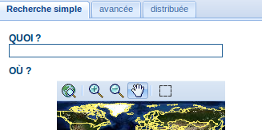

  **Le champ de recherche**

Recherche géographique
``````````````````````

Lors d'une recherche géographque, deux options permettent de sélectionner une
région afin de restreindre l'étendue de la recherche :

Vous pouvez sélectionner une **région** dans une
liste prédéfinie (:ref:`simple_region_field`);

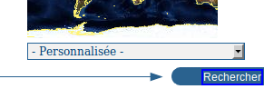

  **Le champ région**

Vous pouvez définir votre propre **zone d'intérêt** de manière
plus interactive. Il vous suffit de la dessiner sur la carte du monde miniature
affichée sur l'écran. Pour cela, cliquez sur le bouton en haut à droite de la carte
(:ref:`aoi_map`);

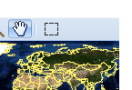

  **Carte interactive où définir les zones d'intérêt**

Effectuer une recherche
```````````````````````

Les deux types de recherche (texte intégral et géographique) peuvent être
combinées pour affiner la requête.

Cliquez sur le bouton Rechercher pour lancer la recherche et
afficher les résultats. (:ref:`search_button`).

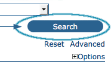

  **Le bouton Rechercher**

Recherche par catégories
------------------------

Une autre méthode pour rechercher des données dans GeoNetwork depuis la page
d'accueil consiste à effectuer une recherche par **catégorie**. L'accès à la liste des catégories permet à l'utilisateur
d'identifier des données de manière plus générique : **Applications**, **Autres ressources**,
**Cartes & graphiques**, **Conférences**, **Étude de cas,
meilleures pratiques**, **Jeux de
données**, **Photographies**, **Répertoires**, **Ressources
interactives**, **Vidéo/Audio**.

Pour rechercher uniquement des cartes, cliquez sur **Cartes
& graphiques** (:ref:`categories`). À partir de la
liste des cartes affichée, vous pouvez accéder à la description d'une carte en
cliquant sur le bouton **Plus d'information** qui y est
associé.

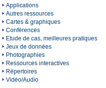

  **Recherche par catégorie**

Recherche avancée
-----------------

L'option de recherche avancée (:ref:`advanced_search`) fonctionne de
manière semblable à la recherche par défaut. Cependant vous pouvez affiner vos
recherches en profitant des différents critères proposés, chacun étant axé sur un
thème particulier : **Quoi ?, Où ?, Quand ?**

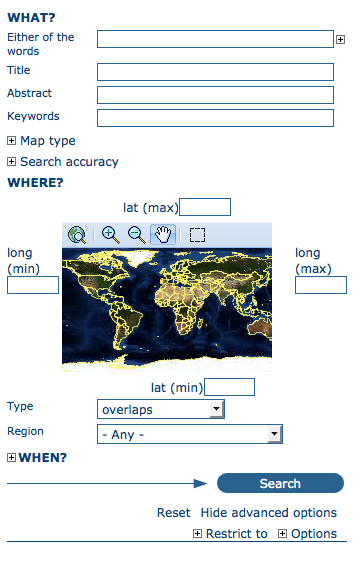

  **Options de recherche avancée**

Pour effectuer une ****recherche avancée**** depuis la page d'accueil, 
**cliquez sur Avancée** situé sous le bouton Rechercher (ref. :ref:`advanced_search_button`).

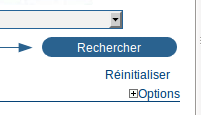

  **Afficher les options de recherche avancée**

Dans la section **QUOI ?** tous les éléments sont
liés au contenu des données. Par leur intermédiaire, au lieu de chercher uniquement
des mots dans l'ensemble des métadonnées, vous pouvez chercher directement dans le
titre ou le résumé et ajouter des mots-clefs pour affiner votre recherche. Vous
pouvez également ajuster le niveau de précision que vous souhaitez atteindre lors de
l'exécution de votre requête (:ref:`adv_what_options`).

- Pour effectuer une recherche dans le **Titre**, le **résumé**, **partout**, ou parmi les **mots-clés**, saisissez votre texte dans le champ approprié.
  Vous pouvez renseigner plusieurs champs simultanément. Si vous souhaitez
  ignorer un critère de recherche, laissez le champ correspondant vide
  ;

- Vous pouvez définir la **précision** de votre
  recherche en terme de justesse orthographique, de **Précis** = 1 à **Imprécis** =
  0.2, avec trois valeurs intermédiaires égales à 0.8, 0.6, 0.4.

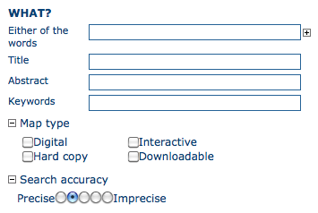

  **La section "Quoi" de la recherche avancée**

Les paramètres de la section **OÙ?** sont liés à
l'empreinte géographique des données. Comme dans la recherche par défaut, ils vous
permettent de définir votre propre zone d'intérêt ou d'en sélectionner une
prédéfinie dans la liste déroulante. Dans cette section, vous pouvez également
saisir les coordonnées géographiques d'une zone d'intérêt. (:ref:`adv_where_options`)

- Pour définir **votre propre zone d'intérêt**,
  dessinez le cadre l'englobant sur la carte du monde en utilisant l'outil
  approprié accessible sur la gauche de la carte (bouton du bas) ;

- Pour saisir **librement les coordonnées** de
  votre zone d'intérêt, renseignez les champs latitude et longitude situés
  autour de la carte. Le nombre de décimales n'est pas limité ;

- Pour utiliser les coordonnées d'une **région
  prédéfinie**, sélectionnez cette région dans la liste
  déroulante.

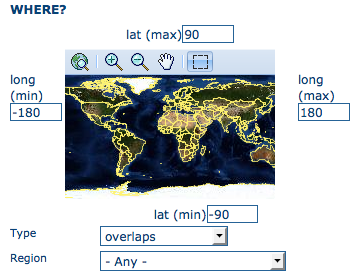

  **La section "Où" de la recherche avancée**

Quelque soit le type de recherche géographique que vous avez décidé d'effectuer,
dans le champ **Type**, vous pouvez choisir une option
parmi celles-ci: **identique**, **chevauche**, **contient**, **en dehors de** (:ref:`adv_where_options`). Si
vous utilisez ce critère, faites attention à la manière dont cela affecte le
résultat de votre recherche :

- Si vous choisissez le **type** de recherche
  spatiale **identique** “Pays”, seules les cartes du pays
  sélectionné seront affichées. En d'autres termes, la carte d'une ville de ce
  pays ne sera pas affichée dans la liste des résultats de la
  recherche.

- Si vous choisissez le **type** de recherche
  spatiale **chevauche** “Pays”, toutes les cartes dont
  l'emprise chevauche ce pays seront affichées dans la liste des résultats :
  c.-à-d. les pays limitrophes, le continent du pays en question et les cartes
  du monde.

- Si vous choisissez le **type** de recherche
  spatiale **contient** “Pays” vous obtiendrez en premier
  dans la liste des résultats les cartes du pays suivies de toutes les cartes
  incluses dans ce dernier.

- De la même manière, si vous choisissez le **type** de recherche spatiale **en dehors**
  d'une région sélectionnée, seules les cartes répondant strictement à ce
  critère sont affichées dans la liste des résultats.

La section **QUAND ?** vous donne la possibilité de
restreindre votre recherche en fonction de critères temporels en indiquant une
période pour la création ou la publication des données (:ref:`adv_when_options`).

- Pour définir une période, cliquez sur le bouton représentant un calendrier
  à côté des champs **Début - Fin**. Utilisez les
  symboles**>** et **>>** en haut du calendrier pour
  choisir d'abord le mois et l'année avant de cliquer sur le jour ; une date
  complète est formatée de la manière suivant : AA-MM-JJ.

- Pour effacer les champs de début et fin de période, cliquez sur la croix
  blanche à la droite du champ fin ; l'option **N'importe
  quand** sera sélectionnée automatiquement et la recherche sera
  exécutée sans aucune restriction temporelle.

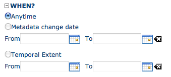

  **La section "Quand" de la recherche avancée**

Enfin, la recherche avancée permet de restreindre la recherche en appliquant des
critères supplémentaires à la source des données, leur catégorie et leur format
(:ref:`adv_more_options`).

- Pour limiter vos requêtes à un seul **Catalogue** parmi ceux rendus accessibles au moment de
  l'installation grâce au mécanisme de moissonnage, cliquez sur le catalogue
  qui vous intéresse. Autrement, sélectionnez **Tous** pour chercher dans tous les catalogues. (Pour en savoir
  plus sur **le moissonnage de métadonnées**,
  veuillez vous référer à la Section 4 Chapitre 1 de ce manuel).

- Pour rechercher des données organisées en **Catégories** telles que Applications, Jeux de données, etc.,
  sélectionnez dans la liste déroulante la catégorie dans laquelle vous
  souhaitez effectuer votre recherche. Autrement, nous vous suggérons de
  laisser sélectionnée la valeur **Tous** dans le
  champ Catégories.

- Vous pouvez chercher des cartes **numériques** ou **imprimées**.
  Pour cela, sélectionnez la case à cocher correspondant au type de carte que
  vous souhaitez rechercher. Si aucune case n'est cochée, la recherche sera
  effectuée pour les deux types de cartes.

Enfin, vous pouvez personnaliser le nombre de résultats affichés par page dans le
champ **Nombre de résultats par page**.

- Cliquez sur le bouton **Rechercher**.

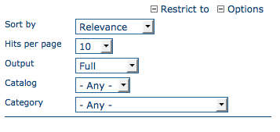

  **Autres options de la recherche avancée**

Analyser les résultats de la recherche
--------------------------------------

Le résultat d'une recherche est constitué d'une liste de métadonnées qui devraient
correspondre à votre requête. Pour chaque élément dans cette liste, le titre, un
résumé et les mots-clefs sont affichés dans la page de résultats. En fonction des
privilèges qui ont été associés à chaque métadonnée, au maximum quatre sections
peuvent être consultées comme le montre la capture d'écran ci-dessous. (:ref:`search_output`)

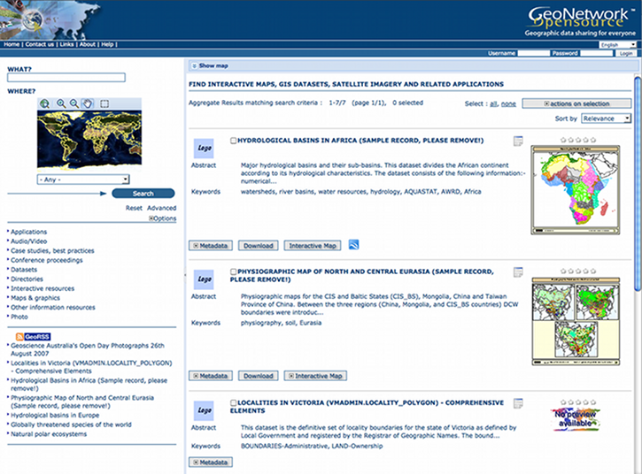

  **Résultats de la recherche**

#. **Métadonnées** : La section relative aux
métadonnées décrit le jeu de données (par exemple : citation, propriétaire
de la donnée, information temporelle / spatiale / méthodologique) et peut
éventuellement contenir des liens vers d'autres sites internet susceptibles
de fournir de plus amples informations sur le jeu de données.

#. **Télécharger** : Selon les privilèges
associés à chaque résultat, lorsque ce bouton est présent, le jeu de données
est disponible et téléchargeable. Accéder aux données est simple et rapide
puisqu'il suffit de cliquer sur le bouton de téléchargement (:ref:`search_result_resource`) ou d'utiliser le lien approprié dans
la section Distribution des métadonnées lorsqu'elles sont affichées en
entier (:ref:`online_resources`).


  .. figure:: search_output1.png
  
    **Un résultat de recherche**


  .. figure:: download.png
  
    **Services disponibles associés à cette ressource**

#. **Carte interactive** : Le service
cartographique est également optionnel. Lorsque ce bouton est visible, une
carte interactive pour cette couche d'information est disponible et, par
défaut, sera affichée sur la carte associée à la recherche simple. Pour
mieux voir la carte, **cliquez** sur **Afficher la carte** situé en bas à droite de la
carte miniature (:ref:`interactive_map`).


  .. figure:: interactive_map.png
  
    **La carte interactive**

#. **Aperçu visuel** : Des aperçus visuels de la
donnée de petite et de grande taille permettent d'évaluer son utilité, en
particulier lorsque la carte interactive n'est pas disponible. Il suffit de
cliquer sur la petite image pour l'agrandir. (:ref:`large_thumbnail`)


  .. figure:: thumbnail.png
  
    **Aperçu visuel de grande taille**

.. _privileges:

Privilèges, rôles and groupes d'utilisateurs
--------------------------------------------

security
privilèges

security
rôles

security
groupes d'utilisateurs

security
restrictions d'accès

GeoNetwork utilise un système constitué de **Privilèges**, de
**Rôles** et de **groupes
d'utilisateurs**.

Il n'y a pas de restrictions imposées aux utilisateurs désireux de rechercher ou
d'accéder à des **informations publiques** contenues
dans un catalogue GeoNetwork opensource. Pour accéder à des **informations à accès restreint** ou à des fonctionnalités avancées, il
est nécessaire de posséder un compte afin de se connecter sur le site. Celui-ci
devrait être fourni par l'administrateur de Geonetwork.

Pour se connecter, il suffit de se rendre sur la page d'accueil, de saisir son nom
d'utilisateur et son mot de passe dans l'angle en haut à droite et de cliquer sur le
bouton de connexion. (Ref. :ref:`login`)

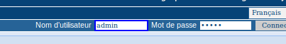

  **Bouton de connexion au catalogue**

Privilèges
``````````

En fonction des privilèges associés à un enregistrement de métadonnées et de
votre rôle en tant qu'utilisateur authentifié, vous serez à même de lire des
informations qui y sont liées et aurez la possibilité de télécharger ou de
visualiser interactivement les données associées à cet enregistrement.

Rôles
`````

Les utilisateurs avec un rôle d'**Éditeur** peuvent créer,
importer et éditer des enregistrements de métadonnées. Ils peuvent également
charger des données et configurer les liens vers les services de cartographie
interactive.

Groupes d'utilisateurs
``````````````````````

Chaque utilisateur authentifié est membre d'un groupe de travail particulier
et a la possibilité de visualiser des données au sein de ce groupe.


