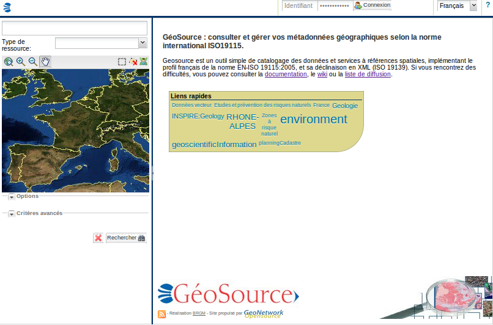

.. _installing:

Installation
============

Nouvelle version - nouvelles fonctionnalités
--------------------------------------------




    *Standard home page of GeoNetwork opensource*


Version 2.7
```````````

- Recherche

 - Recherche distribuée utilisant le protocole Z39.50

- Standard
 
 - Chargement dynamique de profiles
  
- Editeur

 - Publication dans GeoServer

- Administration

 - Module de statistiques

 - Chargement de thésaurus par URL
 
 - Gestion des logos

 - Configuration avancée de l'index Lucene
  

Version 2.6 (Septembre 2010)
````````````````````````````

- Recherche

 - Migration Intermap vers OpenLayers/GeoExt
 
- Administration

 - Notification de noeuds distant : Configurer la mise à jour distante de dépôt
 
- Développement

 - Migration Maven


Version 2.5 (Mai 2010)
``````````````````````

- Recherche & indexation

 - Z39.50 SRU
 
 - Recherche temporelle
 
 - Analyse des types de documents MIME

 - Amélioration des performances
 
 - Export CSV
 
 - Affichage des liens
 
- Edtition

 - Vue INSPIRE
 
 - Saisie multilingue
 
 - Mise à jour des enfants
 
 - Calcul des emprises à partir des mots clés
 
 - Cartographie dynamique pour la saisie des emprises
 
 - Assistant de saisie des projections
 
 - Assistant pour la saisie des mots clés
 
 - Amélioration du rapport de validation
 
 - Gestion des relations entre métadonnées de données et métadonnées de services
 
 - Support ISO19110
 
- Administration

 - Configuration des catégories
 
 - MEF 2


Version 2.4 (juillet 2009)
``````````````````````````


- Recherche & indexation
 
 - Panier de sélection

 - Critères de recherche INSPIRE

 - Impression PDF des résultats

 - Amélioration des performances

 - Amélioration du protocole OGC CSW 2.0.2

- Edition
 
 - Editeur de métadonnées Ajax

 - Opération de mise à jour en masse

- Administration

 - Authentification Shibboleth

  - Enregistrement libre des utilisateurs


Version 2.3
```````````

- Support ISO19119

  
Où télécharger le programme d'installation ?
--------------------------------------------

Vous trouverez les différentes version de GeoNetwork sur le dépôt SourceForge.net http://sourceforge.net/projects/geonetwork/files/.

Utiliser l'installer multi plate-forme (.jar), l'installer exécutable pour Windows (.exe) ou l'archive web (.war).


.. _installation_requirements

Pré-requis système
------------------


GeoNetwork est multi plate-forme. Il fonctionne sous **MS Windows**, **Linux** ou **Mac OS X** .

Pré-requis système :

**Processeur** : 1 GHz ou sup

**Mémoire (RAM)** : 512 MB ou sup

**Espace disque** : 250 MB minimum. L'espace est essentiellement consommé lors de l'ajout de données aux métadonnées.

**Autres logiciels** : 

- `Java Runtime Environment <http://www.oracle.com/technetwork/java/index.html>`_ (JRE 1.5.0 ou sup). 

- Jetty ou Apache Tomcat ou tout autre container Java

- une base de données compatible JDBC (McKoi, MySQL, Postgres, PostGIS, Oracle, SQLServer).

Autres logiciels
````````````````

Ces logiciels ne sont pas nécessaire pour le fonctionnement de GeoNetwork mais peuvent être utilisés en complément :

#. `Druid <http://druid.sourceforge.net/>`_ pour voir le contenu la base de données

#. `Luke <http://www.getopt.org/luke/>`_ pour voir le contenu de l'index Lucene


Navigateurs supportés
`````````````````````

GeoNetwork devrait fonctionner normalement avec les navigateurs suivant :

#. Firefox v1.5 ou sup
#. Internet Explorer v7 ou sup
#. Safari v3 ou sup
#. Chrome
#. Opera


.. _how_to_install:

Comment installer GeoNetwork ?
------------------------------

Avant d'installer GeoNetwork, vérifier que les pré-requis (cf. :ref:`installation_requirements`) sont disponibles et en particulier vérifier que Java est disponible.


Création de la base de données
``````````````````````````````
Si l'utilisateur ne souhaite pas utiliser la base de données par défaut (ie. `Mckoi <http://www.mckoi.com/Mckoi%20SQL%20Database.html>`_), 
il est nécessaire de créer une base de données au préalable. Par exemple, dans le cas de `PostgreSQL <http://www.postgresql.org/>`_, 
il faut donc installer PostgreSQL puis créer une base de données (avec `PgAdmin <http://www.pgadmin.org/>`_ par exemple). 


Une fois créée, il est nécessaire de configurer GeoNetwork pour utiliser cette 
base de données au lancement. Pour cela modifier la configuration dans le fichier web/geonetwork/WEB-INF/config.xml (cf. :ref:`admin_how_to_config_db`).


La base de données est créée au lancement de GeoNetwork. Il est également possible de la créer manuellement en utilisant les scripts SQL
placés dans /web/geonetwork/WEB-INF/classes/setup/sql/create et /web/geonetwork/WEB-INF/classes/setup/sql/data.

Archive web
```````````

Le déploiement de l'archive web se fait par copie du fichier .war dans le répertoire webapp du container Java (eg. webapp pour tomcat).


Installer multi plate-forme
```````````````````````````

L'installer (un fichier .jar) doit démarrer avec un simple double clic. 
En cas d'échec, le menu contextuel peut vous proposer une option pour l'ouvrir avec la version de Java installée sur votre machine.
Si cela ne fonctionne toujours pas, il est possible de lancer l'installation en ligne de commande. Pour cela, ouvrir un terminal, aller dans le répertoire où l'installer se trouve, puis lancer l'installer.


:: 

    cd /repertoire/de/telechargement/de/l/installer
    java -jar geonetwork-install-x.y.z.jar


Suivre les instructions à l'écran.


A la fin de l'installation il est possible de sauvegarder le fichier de configuration de l'installation.

.. figure:: install_script.png
   

Installer sous Windows
``````````````````````

Si vous utilisez Windows, il est également possible d'utiliser l'exécutable. Les étapes sont les suivantes :

1. Double cliquer sur **geonetwork-install-x.y.z.exe** pour lancer l'installation de GeoNetwork opensource
2. Suivre les instructions à l'écran
3. Après l'installation, un menu 'GeoNetwork' est ajouté dans le menu principal de Windows
4. Cliquer Start\>Programs\>GeoNetwork opensource\>Start server pour lancer Geonetwork opensource Web server (ie. Jetty par défaut).
5. Cliquer Start\>Programs\>Geonetwork opensource\>Open GeoNetwork opensource pour ouvrir votre navigateur sur la page d'accueil de GeoNetwork, ou lancer votre navigateur sur la page `http://localhost:8080/geonetwork/ <http://localhost:8080/geonetwork/>`_


   *Installer*

.. figure:: install_packages.png

   *Sélection des modules*


   

Installation en ligne de commande sans interface graphique
``````````````````````````````````````````````````````````

Le plus simple en cas d'absence d'interface graphique sur le serveur est de faire une installation standard sur une machine puis de copier l'ensemble du répertoire sur le serveur.

Sinon, il est possible de réaliser une installation en ligne de commande

::

    java -jar geonetwork-install-x.y.z.jar install.xml
    [ Starting automated installation ]
    [ Starting to unpack ]
    [ Processing package: Core (1/3) ]
    [ Processing package: Sample metadata (2/3) ]
    [ Processing package: GeoServer web map server (3/3) ]
    [ Unpacking finished ]
    [ Writing the uninstaller data ... ]
    [ Automated installation done ]

Pour activer le mode trace ajouter le paramètre *-DTRACE=true*::

  java -DTRACE=true -jar geonetwork-install-x.y.z.jar


Comment migrer une installation GeoNetwork existante ?
------------------------------------------------------

La procédure de migration est réalisée en 4 étapes :

- Sauvegarde de l'ancienne

- Installation de la nouvelle version

- Migration de la base de données

- Migration des données.
 

Tout d'abord, réaliser une installation par défaut (cf. :ref:`how_to_install`).

Version 2.6.x et supérieure
```````````````````````````

Depuis la version 2.6.x, GeoNetwork dispose d'un **mécanisme de migration de la base de données automatique** au démarrage.
Ce mécanisme fonctionne pour la plupart des versions. Pour vérifier, si la version utilisée peut être migrée automatiquement,
vérifier dans la table *Settings* la valeur du paramètre *version*, puis vérifier qu'un répertoire 
existe dans */web/geonetwork/WEB-INF/classes/setup/sql/migrate/{ancienne-version}-to-{nouvelle-version}*.
Si ce n'est pas le cas, il est possible d'utiliser le fichier SQL le plus proche de la version utilisée et l'exécuter manuellement.

Configurer la connexion à la base de données (cf. :ref:`admin_how_to_config_db`).

Lancer la nouvelle version. Dans le fichier *geonetwork.log*, il est possible de vérifier la présence du message suivant:::

	2011-01-12 18:34:26,681 INFO  [jeeves.apphand] -   - Migration ...
	2011-01-12 18:34:26,681 DEBUG [jeeves.apphand] -       Webapp   version:2.7.0 subversion:SNAPSHOT
	2011-01-12 18:34:26,681 DEBUG [jeeves.apphand] -       Database version:2.4.1 subversion:0
	2011-01-12 18:34:26,682 INFO  [jeeves.apphand] -       Migrating from 2.4.1 to 2.7.0 (dbtype:postgres)...
	2011-01-12 18:34:29,225 INFO  [jeeves.apphand] -       Setting catalogue logo for current node identified by: 207e9569-9027-487f-922c-652dd3039a9a
	2011-01-12 18:34:29,233 INFO  [jeeves.apphand] -       Successfull migration.
	      Catalogue administrator still need to update the catalogue
	      logo and data directory in order to complete the migration process.
	      Lucene index rebuild is also recommended after migration.
	2011-01-12 18:34:29,233 INFO  [jeeves.apphand] -   - Thesaurus..


Si une nouvelle installation est lancée sur une ancienne base GeoNetwork et qu'aucun script de migration n'est défini, le message suivant est affiché dans les logs:::

	No migration task found between webapp and database version.
	The system may be unstable or may failed to start if you try to run
	the current GeoNetwork 2.7.0 with an older database (ie. 2.4.0
	). Try to run the migration task manually on the current database
	before starting the application or start with a new empty database.
	Sample SQL scripts for migration could be found in WEB-INF/sql/migrate folder.


Une fois lancée, il est nécessaire de **migrer les données** :

- Tout d'abord, les données associées aux métadonnées. Pour cela, il faut copier le contenu du répertoire data
  (par défaut à la racine de l'installation de GeoNetwork) vers la nouvelle installation (par défaut dans le répertoire web/geonetwork/WEB-INF/data). 

- Ensuite les logos. Copier le répertoire web/geonetwork/images/logo et web/geonetwork/images/harvesting vers la nouvelle installation.


Version 2.4.x
`````````````

GAST permet de réaliser la migration d'une version précédente (2.2.x ou 2.0.x) vers la série des versions 2.4.x.

Pour ces versions là, il est également recommandé d'utiliser GAST pour migrer les métadonnées de l'ancien format ISO19115 vers l'ISO19139.