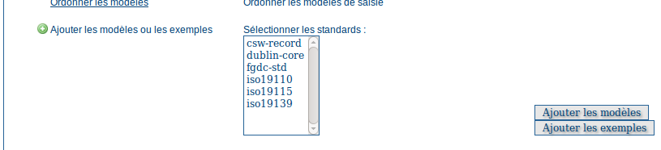

.. _samplemetadata:

Echantillon de métadonnées
==========================

A partir de la page d'accueil, s'authentifier avec le nom d'utilisateur et mot de passe par défaut : admin/admin.

Allez dans l'administration, puis ajouter les modèles et les exemples de métadonnées :

    *Ajout des exemples de métadonnées*
